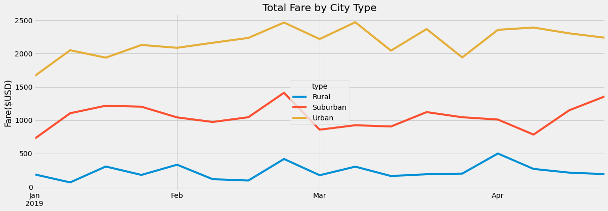
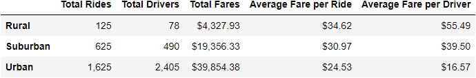

# PyBer Analysis

## Overview
Create a summary table of *PyBer* ride-sharing data by city type (urban, suburban, or rural), and use it to create a multi-line graph that shows the weekly fares for each type of city. Using the table and graph, analyze how the differences in ride sharing based on city type can increase PyBer revenue.

## Resources
- Software:
  - Python 3.10.4
    - Pandas package (to process DataFrames)
    - dataframe_image package (to save Pandas Dataframes as images)
    - Matplotlib package (to create graphs and plots)
  - Jupyter Notebook
- Data Sources:
  - city_data.csv
  - ride_data.csv

## Analysis and Results
### Fares per Week by City Type

#### The Graph
We see, in the following graph, fare-based revenue, plotted week-by-week, separated by city type (urban, suburban, or rural).

#### Analysis
Based on the graph, we can conclude that, within eacy city type, fare-based revenue is fairly consistent. (Each line is relatively flat.) This would indicate that revenue is only slightly affected (if at all) by time.  
&nbsp;
### City-Type Summary

#### The Table
The following table shows several metrics from which we can draw conclusions for each city type.

#### Analysis
We see that each of the metrics in the first three columns of the table increases as we progress from rural to suburban to urban. In the last two columns, however, we see that the average fare—measured both on a per-ride and on a per-driver basis—*decreases* as we progress from rural to suburban to urban.

It is also worth examining the ratio of drivers to rides in each category:
- Rural:      78 /  125 =  62.4%
- Suburban:  490 /  625 =  78.4%
- Urban:    2405 / 1625 = 148.0%

Note that, in the urban category, there are actually 48% *more* drivers than there are rides.  
&nbsp;
### Revenue Calculations and Supply and Demand
Total revenue is, of course, the product of the number of rides and the fares charged for those rides. So, in order to increase revenue, we can either:
1. increase rates
2. increase the number of rides

#### Considering Option 1: Increasing Rates
Increasing rates will only serve to increase revenue provided the number of rides does not fall too much as a result of the rate increase. The laws of supply and demand indicate that a rate increase *will* decrease ridership, so we have to make sure than any rate increases are moderate enough that they don't overly impact the number of rides.

#### Considering Option 2: Increasing Rides
Since the number of potential riders is essentially fixed, we can increase actual rides only by attracting new users, turning purely potential riders into actual riders. The correct strategy to do this depends on what is preventing that potential rider from becoming an actual rider:
1. The potential rider doesn't ride because of lack of access to drivers.
   - This can be remedied by increasing the number of drivers available to the potential rider.
2. The potential rider doesn't ride because the ride is too expensive.
   - This can be remedied by decreasing the fare for the ride. This, however, works counter to the principle of increasing revenue by increasing rates and has the opposite concern: in could increase ridership to the point at which they once again do not ride, but now not because of price, but instead due to lack of available drivers, which returns us to case 1, above.

## Plans of Action
The most notable feature in the analysis is the 148% ratio of drivers to rides in the urban category. Step 1, therefore, should be to shift drivers from urban locations to suburban or rural. This can be encouraged by noting the higher fare-per-ride and fare-per-driver values in the suburban and rural environments. This will should have little, if any, change to urban revenue, but could potentially increase revenue in the urban and suburban areas because it mitigates any limitation imposed on actual ridership due to a lack of drivers.

Additionally, the fact that the urban environment has more drivers than rides indicates that ridership in urban areas is already saturated at that the current fare prices (because we know that a lack of available rides is not the problem). Therefore, PyBer should decrease fares in urban environments until we see the number of rides exceed the number of drivers.

Likewise, PyBer may be able to increase fares in the suburban and rural areas, but, given that ridership is already lower in these areas, these increases should be kept small so as to minimize the number of riders who might be discouraged from riding by the higher prices.